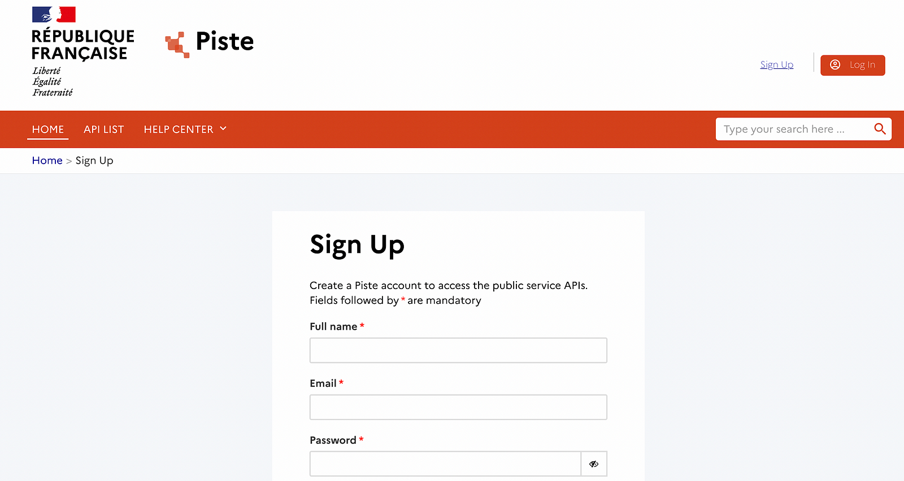
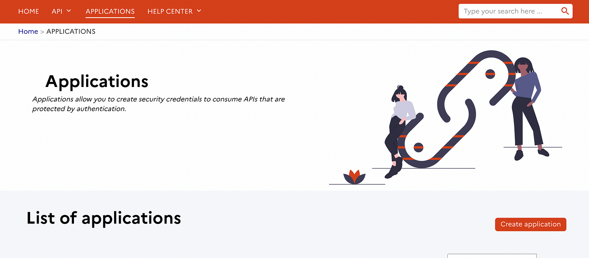
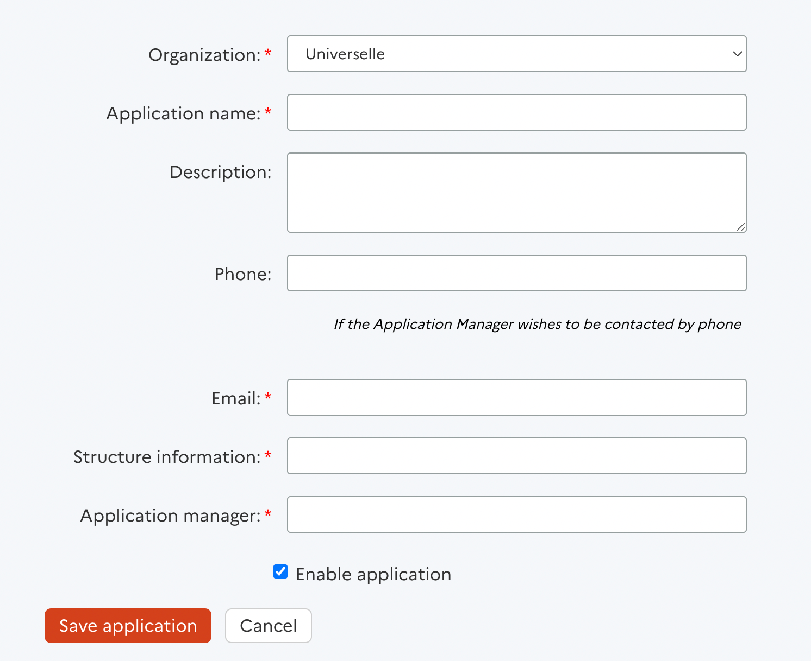
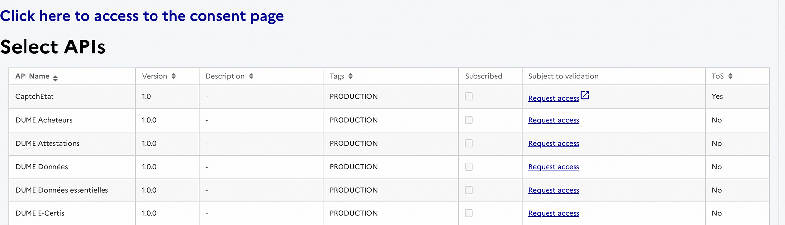
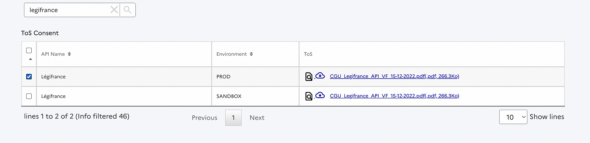
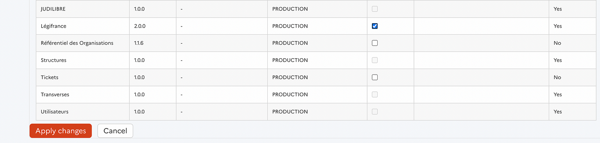
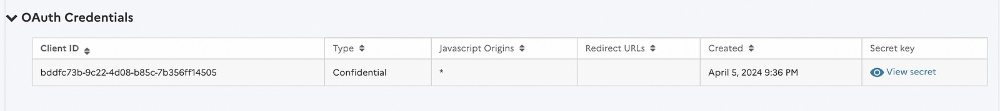

# Advanced RAG system on legal data
In this project we explore implementing a basic and then an advanced RAG system using techniques like windowing, hybrid-search, query rewriting and routing. We also explore evaluating these techniques and others to help make choices about the RAG pipeline components. More details and a step by step tutorial here: https://medium.com/@hamzagharbi_19502/building-a-comprehensive-rag-system-advanced-features-and-in-depth-evaluation-3551be31858f

## Quickstart 

First clone this github repository: 
```
git clone git@github.com:HamzaG737/legal-code-rag.git
```

Next, you'll need to install the necessary packages. We used poetry as our package manager for better handling of project dependencies. Install poetry using the following command. 

```
curl -sSL https://install.python-poetry.org | python3 -
```


You can find more about poetry installation here. todo add link

Then, at the root of the project, use the following command to install the Python packages:
```
poetry install
```

Finally, ensure the `OPENAI_API_KEY` environment variable is defined as we will utilize both OpenAI's `gpt-3.5-turbo` LLM and Ada embeddings in this project. If you're interested in conducting the experiment with Mistral embeddings, you must obtain an API key from the Mistral platform. Then you need to create the environment variable `MISTRAL_API_KEY` with that key value.

## Get the law codes data 
The knowledge base consists of France legal Codes. You can get this data in two ways:
* Load fresh data from the Legifrance API. Instructions on creating the API keys can be found in the section **Get Legifrance API keys**. We'll use the Python library pylegifrance to request specific codes from the API.
* Load processed data from the repository at `./data/legifrance/ {code_name}.json`. This behaviour is the default.

## Set-up the vector database

Qdrant will be used as a vector database to store and index the articles embeddings along with the meta-data. We will run the server locally using Qdrant official docker image. 

First you can pull the image from the Dockerhub: 
```
docker pull qdrant/qdrant
```
Following this, run the Qdrant service with the command below. This will also map the necessary ports and designate a local directory (`./qdrant_storage`) for data storage:
```
docker run -p 6333:6333 -p 6334:6334 \
    -v $(pwd)/qdrant_storage:/qdrant/storage:z \
    qdrant/qdrant
```

## Create your first query engine

The query engine represents an end-to-end RAG pipeline. You can create a basic query engine like this:

```
from query.query_engine import create_query_engine

query_engine = create_query_engine()

response = query_engine.query("How can we cancel a wedding ?")

print(response)

```

## Get Legifrance API keys

First you need to sign up to the official french website https://developer.aife.economie.gouv.fr/en that gives you access to many public APIs.



After signing up, navigate to Applications and create a new application.



On the next page, you need to enter the application name, email, structure information (for which I simply put the description), and the application manager's name (I put mine). After entering these details, save the application.



Then you will have to consent on the terms of service by clicking on "Click here to access to the consent page".



Look for legifrance, tick the box corresponding to PROD environment and finally click validate my ToS choices.



Then go back to the created application, click on Edit Application and scroll to Select APIs. In the corresponding table, find Légifrance and tick on Subscribed . Finally click on Apply changes .



Now go back to the application main page and look for the OAuth Credentials.



In `./data_ingestion/preprocess_legifrance_data.py`, you can see how we can set the API keys. The env LEGIFRANCE_API_KEY corresponds to the Client ID above, and LEGIFRANCE_API_SECRET corresponds to the Secret key.

```
from pylegifrance import LegiHandler

client = LegiHandler()
client.set_api_keys(
    legifrance_api_key=os.getenv("LEGIFRANCE_API_KEY"),
    legifrance_api_secret=os.getenv("LEGIFRANCE_API_SECRET"),
)
```
